

    

<h1 align="center" style="font-weight: bold;">👾 Pojetos da ORIGAMID 👾</h1>
 
 

    <b>Olá 👋, este repositório é onde eu armazeno todos os projetos realizados durante o curso da ORIGAMID.</b>   
    <a href="https://www.origamid.com/">👾Ver Curso👾</a>
 

 

<h2>🏗️ Lista de Projetos: </h2>

<ol>
  <li>
   <b>HTML e CSS para iniciantes: </b>
   <ul>
    <li><a href="#responsive-excercise">Responsive-Exercise</a></li>
    <li><a href="#portifolio-project">Portifolio-Project</a></li>
    <li><a href="#refactor-excercise">Refactor-Excercise</a></li>
    <li><a href="#refactor-excercise(dark)">Refactor-Excercise(Dark)</a></li>
    <li><a href="#bikcraft">Bikcraft</a></li>
   </ul>
  </li>
  <li>
   <b>CSS e Flexbox: </b>
   <ul>
     <li><a href="#flexblog">FlexBlog</a></li>
   </ul>
  </li>
</ol>

 
 
 

<h1 id="responsive-excercise" align="center">👾 Responsive-Exercise 👾</h1>

 <a href="#responsive-excercise_tecnologias">Tecnologias</a> • 
 <a href="#responsive-excercise_comecar">Vamos Começar</a> • 
<a href="#responsive-excercise_desafio">Desafio</a>

<h4 align="center">Esse projeto é o primeiro que desenvolvemos nessa parte do curso, e nela somos desafiados a criar uma página home totalmente responsiva!</h4>

    <a href="https://mellonickolas.github.io/Projects-Origamid/Responsive-Exercise/">👾VER DEPLOY👾</a>

 

    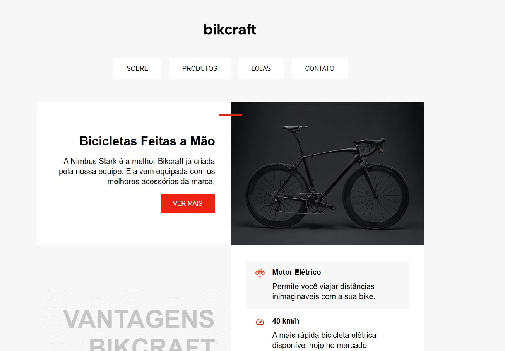
    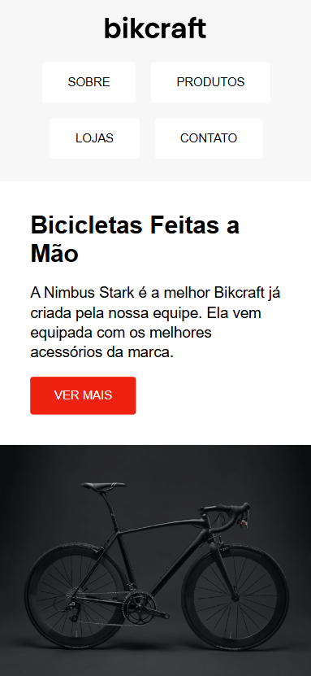

 

<h2 id="responsive-excercise_tecnologias">💻 Tecnologias</h2>

- **HTML**
- **CSS** (Usado para criar a responsividade do site)

Nesse projeto foi usado apenas essas tecnologias de maneira pura, sem o uso de qualquer biblioteca! 😽

<h2 id="responsive-excercise_comecar">🚀 Vamos começar</h2>

Nesse projeto não temos nenhum requisito para rodá-lô, somente o vs-code, e a extensão do <b>LIVE SERVER</b>.

Assim que obter os dois basta clonar o projeto e abrir o index.html com seu live server e pronto!, esse projeto estara rodando no servidor local! 

<h2 id="responsive-excercise_desafio">🎮 Como fui desafiado</h2>

Para realizar o código fui desafiado com os seguintes tópicos: 

- Gerar um código 100% responsivo.
- Manter a mesma estética do desgin inicial.

Com essa premissa realizei o desafio e cheguei no resultado que você pode conferir no deploy!

(<a href="#readme-top">back to top</a>)

 
 
 

<h1 id="portifolio-project" align="center">👾 Portifolio-Project 👾</h1>

 <a href="#portifolio-project_tecnologias">Tecnologias</a> • 
 <a href="#portifolio-project_comecar">Vamos Começar</a> • 
<a href="#portifolio-project_desafio">Desafio</a>

<h4 align="center">Conheça um portifólio do programador Lobo, e veja os seus projetos e tecnologias!</h4>

    <a href="https://mellonickolas.github.io/Projects-Origamid/Portifolio-Project/">👾VER DEPLOY👾</a>

 

    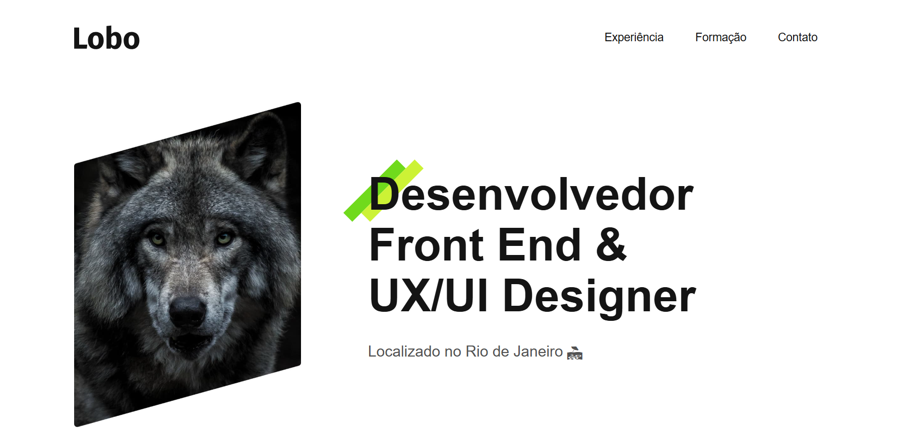
    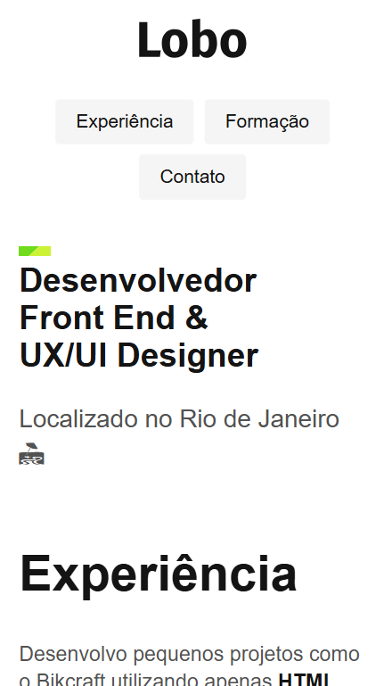

 

<h2 id="portifolio-project_tecnologias">💻 Tecnologias</h2>

- **HTML**
- **CSS** (Usado para criar a responsividade do site)

Nesse projeto foi usado apenas essas tecnologias de maneira pura, sem o uso de qualquer biblioteca! 😽

<h2 id="portifolio-project_comecar">🚀 Vamos começar</h2>

Nesse projeto não temos nenhum requisito para rodá-lô, somente o vs-code, e a extensão do <b>LIVE SERVER</b>.

Assim que obter os dois basta clonar o projeto e abrir o index.html com seu live server e pronto!, esse projeto estara rodando no servidor local! 

<h2 id="portifolio-project_desafio">🎮 Como fui desafiado</h2>

O desafio foi realizar um portifólio para um programador hipotético chamado Lobo, nesse site teriamos que atingir as seguintes metas:

- Gerar um código 100% responsivo.
- Manter a mesma estética do desgin inicial.
- Mostrar os projetos imáginarios de uma forma explicita.

Com essa premissa realizei o desafio e cheguei no resultado que você pode conferir no deploy!

(<a href="#readme-top">back to top</a>)

 
 
 

<h1 id="refactor-exercise" align="center">👾 Refactor-Exercise 👾</h1>

 <a href="#refactor-exercise_tecnologias">Tecnologias</a> • 
 <a href="#refactor-exercise_comecar">Vamos Começar</a> • 
<a href="#refactor-exercise_desafio">Desafio</a>

<h4 align="center">Uma página home responsiva! com o uso do grid! </h4>

    <a href="https://mellonickolas.github.io/Projects-Origamid/Refactor-Exercise/">👾VER DEPLOY👾</a>

 

    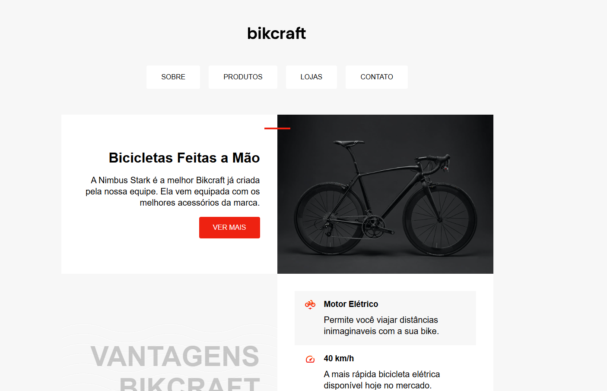
    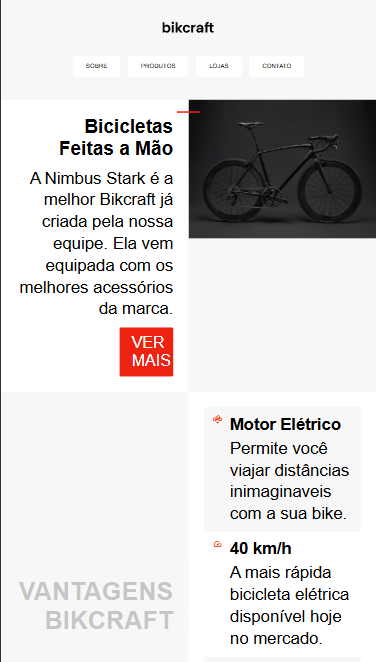

 

<h2 id="refactor-exercise_tecnologias">💻 Tecnologias</h2>

- **HTML**
- **CSS** (Usado para criar o grid do site!)

Nesse projeto foi usado apenas essas tecnologias de maneira pura, sem o uso de qualquer biblioteca! 😽

<h2 id="refactor-exercise_comecar">🚀 Vamos começar</h2>

Nesse projeto não temos nenhum requisito para rodá-lô, somente o vs-code, e a extensão do <b>LIVE SERVER</b>.

Assim que obter os dois basta clonar o projeto e abrir o index.html com seu live server e pronto!, esse projeto estara rodando no servidor local! 

<h2 id="refactor-exercise_desafio">🎮 Como fui desafiado</h2>

O desafio foi realizar uma página home de uma loja de bicicletas com o uso do GRID:

- Gerar um código com o uso do display(grid) com responsividade.
- Criar um design agradável para os clientes.

Com esses requisitos realizei esse projeto!

(<a href="#readme-top">back to top</a>)

 
 
 

<h1 id="refactor-excercise(dark)" align="center">👾 Refactor-Exercise(Dark) 👾</h1>

 <a href="#refactor-exercise(dark)_tecnologias">Tecnologias</a> • 
 <a href="#refactor-exercise(dark)_comecar">Vamos Começar</a> • 
<a href="#refactor-exercise(dark)_desafio">Desafio</a>

<h4 align="center">Uma página home responsiva! com o uso do grid e usando o modo dark dos navegadores! </h4>

    <a href="https://mellonickolas.github.io/Projects-Origamid/Refactor-Exercise/">👾VER DEPLOY👾</a>

 

    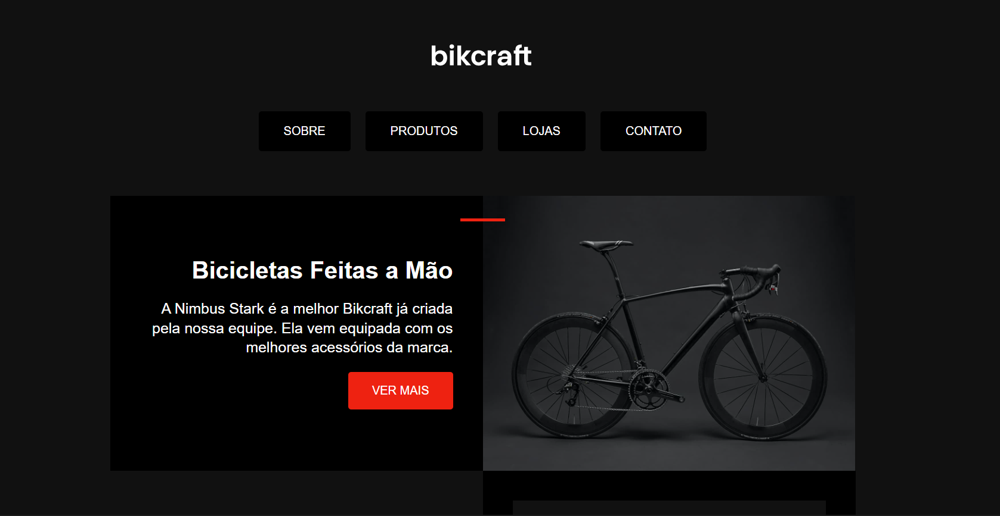
    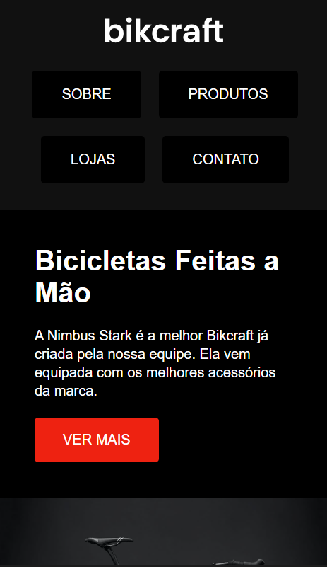

 

<h2 id="refactor-exercise(dark)_tecnologias">💻 Tecnologias</h2>

- **HTML**
- **CSS** 

Nesse projeto foi usado apenas essas tecnologias de maneira pura, sem o uso de qualquer biblioteca! 😽

<h2 id="refactor-exercise(dark)_comecar">🚀 Vamos começar</h2>

Nesse projeto não temos nenhum requisito para rodá-lô, somente o vs-code, e a extensão do <b>LIVE SERVER</b>.

Assim que obter os dois basta clonar o projeto e abrir o index.html com seu live server e pronto!, esse projeto estara rodando no servidor local! 

<h2 id="refactor-exercise(dark)_desafio">🎮 Como fui desafiado</h2>

O desafio foi realizar o modo dark de um exercicio que ja foi feito anteriormente chamado refactor-exercise

- Gerar um código com o uso do display(grid) com responsividade.
- Criar um design agradável, com um modo dark.

Com esses requisitos realizei esse projeto!

(<a href="#readme-top">back to top</a>)

 
 
 

<h1 id="bikcraft" align="center">👾 Bikcraft 👾</h1>

 <a href="#bikcraft_tecnologias">Tecnologias</a> • 
 <a href="#bikcraft_comecar">Vamos Começar</a> • 
<a href="#bikcraft_desafio">Desafio</a>

<h4 align="center"> Uma loja de bicicletas que também oferece serviços de seguros para as mesmas! </h4>

    <a href="https://mellonickolas.github.io/Projects-Origamid/Bikcraft/">👾VER DEPLOY👾</a>

 

    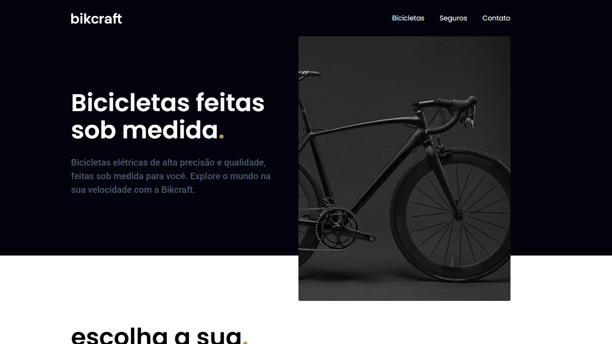
    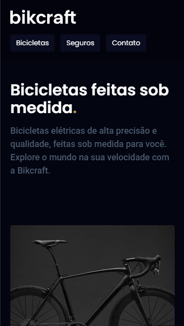

 

<h2 id="bikcraft_tecnologias">💻 Tecnologias</h2>

- **HTML**
- **CSS**
- **PHP**
- **Javascript**

Este projeto foi realizado com o intuito de mostrar as bicicletas e receber e-mails através do envio do formulário!, além de usar um plugin de animações via javascript 😽

<h2 id="bikcraft_comecar">🚀 Vamos começar</h2>

Nesse projeto não temos nenhum requisito para rodá-lô, somente o vs-code, e a extensão do <b>LIVE SERVER</b>.

Assim que obter os dois basta clonar o projeto e abrir o index.html com seu live server e pronto!, esse projeto estara rodando no servidor local! 

<h2 id="bikcraft_desafio">🎮 Como fui desafiado</h2>

O desafio foi realizar um site onde tivesse uma vitrine para uma loja de bicicletas onde oferece serviços de seguros para a mesma, além de realizar o envio de um formulário via <strong>PHP</strong>.

- Botar em prática um design realizado pelo professor.
- Manter a responsividade do site.
- Realizar o envio de formulário ao seu e-mail via **PHP**.
- Usar um plugin de animações que foi repassado pelo professor.

Com esse desafio, coloquei em prática os conhecimentos que adquiri ao longo do curso!

(<a href="#readme-top">back to top</a>)

 
 
 
 
 
 
 
 
 

<h1 id="flexblog" align="center">👾 FlexBlog 👾</h1>

 <a href="#flexblog_tecnologias">Tecnologias</a> • 
 <a href="#flexblog_comecar">Vamos Começar</a> • 
<a href="#flexblog_desafio">Desafio</a>

<h4 align="center"> Um blog que mostra noticias e oferece serviços! </h4>

    <a href="https://mellonickolas.github.io/Projects-Origamid/FlexBlog/">👾VER DEPLOY👾</a>

 

    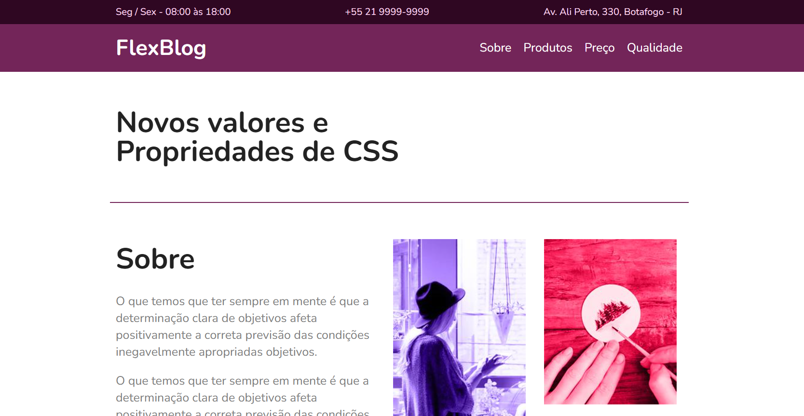
    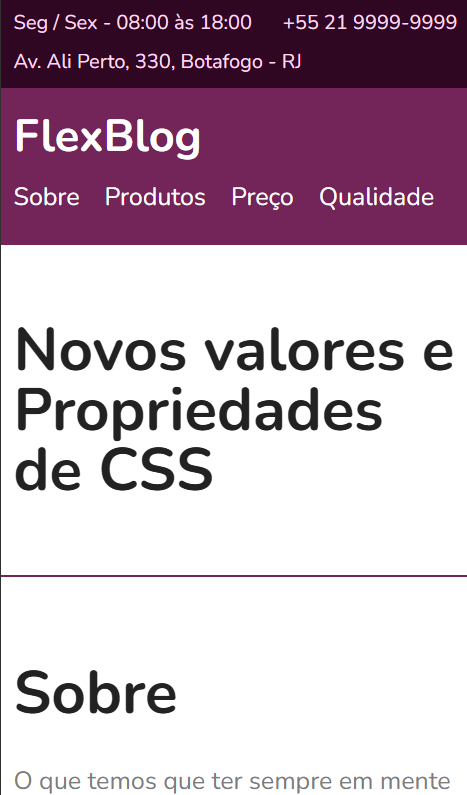

 

<h2 id="flexblog_tecnologias">💻 Tecnologias</h2>

- **HTML**
- **CSS**

Usando o flexbox realizei um projeto 100% responsivo. 😽

<h2 id="flexblog_comecar">🚀 Vamos começar</h2>

Nesse projeto não temos nenhum requisito para rodá-lô, somente o vs-code, e a extensão do <b>LIVE SERVER</b>.

Assim que obter os dois basta clonar o projeto e abrir o index.html com seu live server e pronto!, esse projeto estara rodando no servidor local! 

<h2 id="flexblog_desafio">🎮 Como fui desafiado</h2>

Realizar um blog de noticias 100% responsivo com o uso do flexbox.

- Usar o FlexBox para conquistar a responsividade.

Durante as aulas aprendi a usar o FlexBox, e coloquei o conhecimento em prática.

(<a href="#readme-top">back to top</a>)

 
 
 
